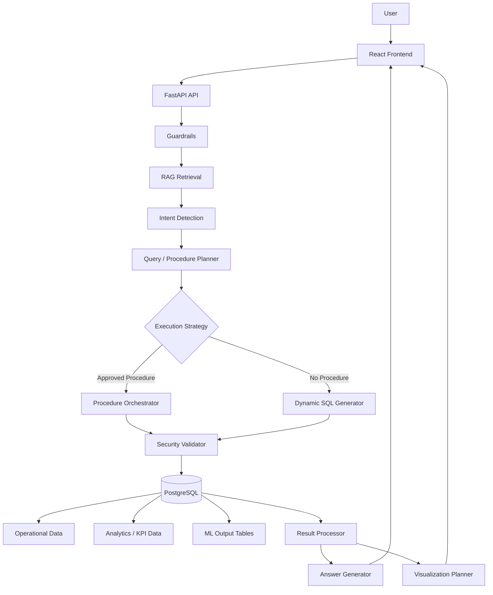

# QueryMind

QueryMind is an enterprise analytics platform for AI-tool usage, team productivity, and generated insight consumption. Machine-learning training is outside this repository; the application reads persisted analytics and synthetic demo outputs through approved database functions.

## Current milestone

This repository now includes both the database foundation and the first query-intelligence layer:

- PostgreSQL schema is defined and migratable.
- Synthetic reference data is generated deterministically.
- Synthetic usage events are generated in configurable profiles.
- ML output tables for forecast, risk, segmentation, anomalies, and throughput are created.
- Approved procedure registry and execution engine are implemented.
- RAG schema metadata and table-document retrieval are available.
- Intent detection and multi-step execution planning are implemented.
- SQL guardrails enforce read-only execution and reject dangerous patterns.
- FastAPI query endpoints provide a working read-only pipeline.
- A minimal React UI shell calls the query service locally.

This milestone is designed to support the next layer of analytics orchestration and UI refinement without moving into full model training or large-scale production deployment.

## Architecture overview



## ML integration principle

> QueryMind does not train ML models. It consumes persisted ML outputs generated by a separate ML pipeline.

This separation is deliberate and is documented in the schema and generated data.

## Repository structure

```text
.
├── backend/
│   ├── app/
│   │   ├── core/
│   │   └── db/
│   └── tests/
├── data_generator/
├── database/
│   ├── migrations/
│   ├── schema/
│   ├── indexes/
│   └── seeds/
├── docs/
├── scripts/
├── docker-compose.yml
├── .env.example
├── .gitignore
├── requirements.txt
├── README.md
└── .git
```

## PostgreSQL schema

The database includes the core enterprise tables for:

- departments
- practices
- teams
- users
- ai_tools
- ai_tasks
- ai_tool_usage
- team_work_metrics
- ml_tool_adoption_forecast
- ml_user_adoption_risk
- ml_user_segments
- ml_usage_anomalies
- ml_team_productivity_forecast
- ml_tool_recommendations

Synthetic data is deterministic and generated from a fixed seed so local tests remain reproducible.

## Data generation

Use the bootstrap script to create the schema and seed a PostgreSQL database. Configure `DATABASE_URL` in the environment first; never commit credentials:

```bash
python3 -m pip install -r requirements.txt
docker compose up -d postgres
DATABASE_URL="$DATABASE_URL" \
python3 scripts/bootstrap_db.py --scale small
```

Available scales:

- small: 10,000 usage events
- medium: 1,000,000 usage events
- large: 10,000,000 usage events

The large profile is supported by the generator but is intentionally not committed to source control.

## Database tests

```bash
PYTHONPATH=. pytest backend/tests/test_database.py -q
```

## Docker Compose

```bash
docker compose up -d postgres
```

The local environment includes a PostgreSQL container ready for the database bootstrap and tests.

## Milestone status

Completed:

- repository scaffold
- PostgreSQL service configuration
- migration SQL for core schema and ML output tables
- deterministic synthetic data generators
- usage-data generation by scale profile
- ML output generation scripts
- Docker Compose setup
- basic database tests
- documentation update

Tests:

- `pytest backend/tests/test_database.py -q` → passed (3/3)

How to run:

```bash
cd /workspaces/QueryMind
python3 -m pip install -r requirements.txt
docker compose up -d postgres
python3 scripts/bootstrap_db.py --scale small
PYTHONPATH=. pytest backend/tests/test_database.py -q
```

Next milestone:

- expand the procedure execution engine with real SQL-backed executions
- add richer multi-step planning for cross-table analytics
- strengthen RAG retrieval with canonical question and glossary sources
- complete a production-style React dashboard with charting and history
- add async execution, observability, and deployment polish

## Security and scope boundary

This repository intentionally does not include model training pipelines or inference code. It consumes persisted ML outputs and keeps model development outside the application boundary.

## Local chatbot and model routes

The QueryMind app provides an English-language analytics chat, saved-question history, CSV export, and chart/table views from approved database functions. It uses Neon/PostgreSQL if a real `DATABASE_URL` is configured, otherwise it uses the local SQLite demo database. Start the API and frontend in separate terminals:

```bash
cd /workspaces/QueryMind
PYTHONPATH=. python3 -m uvicorn backend.app.main:app --host 0.0.0.0 --port 8000
```

```bash
cd /workspaces/QueryMind/frontend
npm install
npm run dev
```

The Vite dev server proxies `/api` to FastAPI at port 8000. The local SQLite database is created on first use. The UI works without model credentials using the deterministic, database-grounded English answer path.

LLM calls use Groq's OpenAI-compatible API with task-specific models: `llama-3.1-8b-instant` for intent detection, `llama-3.3-70b-versatile` for English answers, `openai/gpt-oss-20b` for insight summaries, and `qwen/qwen3-32b` for visualization choices. Groq's developer tier has usage and rate limits, so availability can vary by account and quota. Put the Groq key in `GROQ_API_KEY` in the ignored repo-root `.env` file; it is never sent to the browser. Do not put secrets in `.env.example` or frontend files. The intent route can choose only supported analytics intents; visualization output is allowlisted; model-generated SQL is not accepted or executed. If a route is unavailable, its action uses the deterministic fallback.

## Neon demo database

Run [database/neon_demo_setup.sql](database/neon_demo_setup.sql) in the Neon SQL Editor to create the PostgreSQL schema, table-returning analytics functions, and bounded synthetic dataset. It creates 250,000 usage events and includes database/table size checks; reduce the `generate_series(1, 250000)` upper bound to `100000` for a smaller first run. The `ml_*` records are synthetic examples, not trained model predictions. The script has been syntax-parsed locally, but not executed against a Neon project.

Set the Neon PostgreSQL connection string as `DATABASE_URL` in the ignored repo-root `.env` file. For app runtime, use the Neon pooled hostname and retain `sslmode=require`; the API falls back to SQLite if the URL is missing or still contains placeholders.
