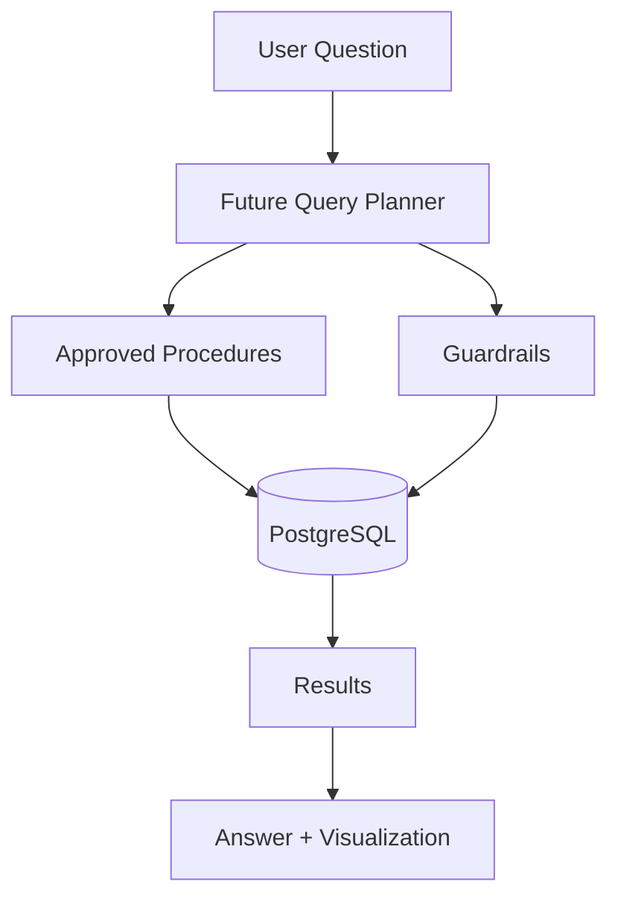

# InsightMesh architecture overview

## Current scope

This repository currently contains the database foundation for InsightMesh. It covers the synthetic enterprise data model, deterministic seed generation, PostgreSQL schema, ML-output tables, and milestone 1 verification.

## Separation of concerns

- Operational analytics: observed usage, teams, tasks, and productivity metrics
- ML integration: forecast, risk, segmentation, anomaly, and throughput outputs
- Future layers: RAG, planner, guardrails, secure SQL, and frontend analytics

## High-level flow

## ML boundary

> ML model development and inference pipelines are intentionally maintained as a separate project. InsightMesh consumes persisted outputs through PostgreSQL.

The schema is therefore designed to accept remote ML-generated data without coupling the application to the training stack itself.
